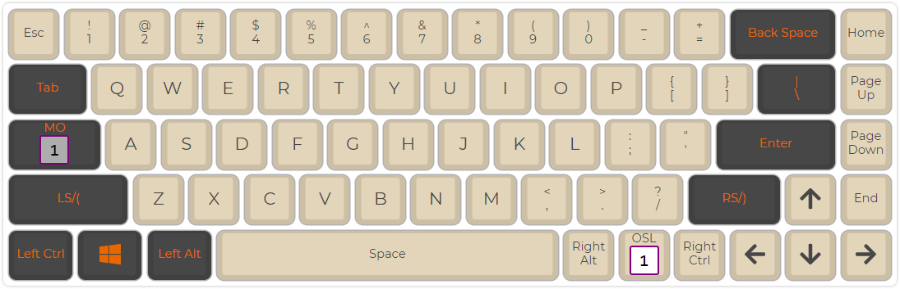
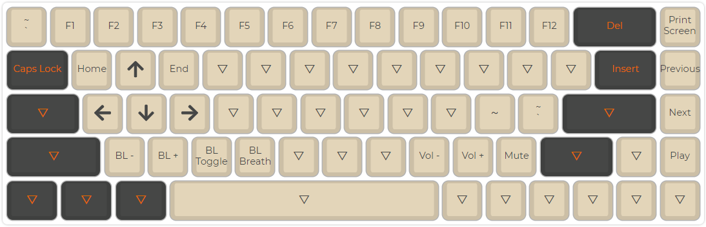

# spacenav

This layout was generated by the [QMK Configurator](https://config.qmk.fm/#/tada68/LAYOUT_ansi). 

The compiled firmware can be found in tada68_spacenav.bin.

If you would like to modify this layout using the QMK Configurator, upload "spacenav.json" via the "keymap.json" upload button.

## Layer 0

## Layer 1
