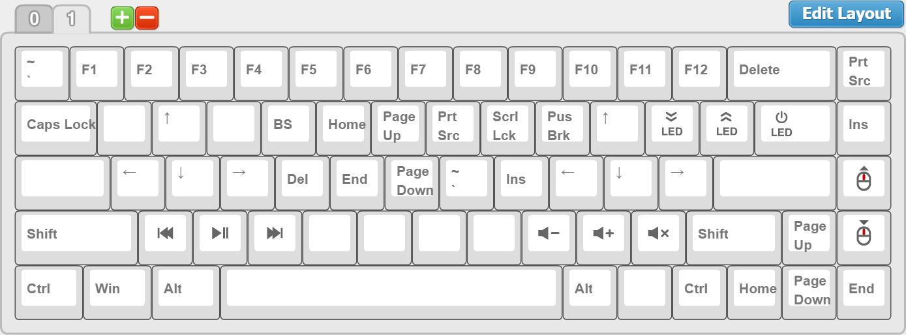

[TADA68 Firmware Editor: v60ish Layout](http://123.57.250.164:3000/tada68#A5EFF27554B7D440B020D76BB83463CD)

Based on one of the layout options for the [KBParadise V60](https://deskthority.net/wiki/KBP_V60_MTS)

